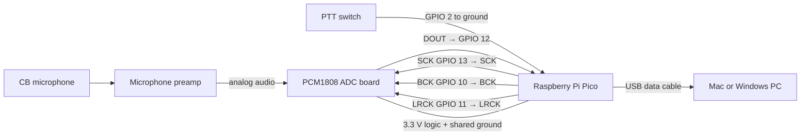

# Wiring and parts

The box turns the CB microphone into a four-channel USB audio device. Audio is on USB channel 1; the push-to-talk marker is on channel 2.

## Pin table

| Pico | Connects to | Purpose |
|---|---|---|
| GPIO 2 | PTT switch; other side to GND | Active-low push-to-talk |
| GPIO 10 | PCM1808 BCK | I²S bit clock |
| GPIO 11 | PCM1808 LRCK | I²S left/right clock |
| GPIO 12 | PCM1808 DOUT | Digital audio into Pico |
| GPIO 13 | PCM1808 SCK | ADC system clock |
| GND | Preamp, ADC, PTT ground | Required common ground |

Do not feed CB microphone-level or speaker-level audio directly into a Pico pin. Use the preamp and ADC, confirm the ADC board's supply requirements, and keep all digital signals at 3.3 V logic.

## Parts list

These are ordinary Amazon search links, not affiliate links yet. To use Amazon Associates, replace each link's `tag=cbvoicebox-20` placeholder with your approved Associates tracking ID and clearly disclose commissions wherever the links are published.

- [Raspberry Pi Pico](https://www.amazon.com/s?k=Raspberry+Pi+Pico&tag=cbvoicebox-20)
- [PCM1808 audio ADC module](https://www.amazon.com/s?k=PCM1808+ADC+module&tag=cbvoicebox-20)
- [Electret/dynamic microphone preamp module](https://www.amazon.com/s?k=microphone+preamp+module+adjustable+gain&tag=cbvoicebox-20)
- [Data-capable Micro-USB cable](https://www.amazon.com/s?k=micro+usb+data+cable&tag=cbvoicebox-20)
- [Dupont jumper wire kit](https://www.amazon.com/s?k=dupont+jumper+wires&tag=cbvoicebox-20)
- [Small project enclosure](https://www.amazon.com/s?k=small+electronics+project+box&tag=cbvoicebox-20)

Exact preamp choice and the connection to a particular CB microphone depend on that microphone's pinout and whether it is dynamic or electret. Verify those before applying power.
